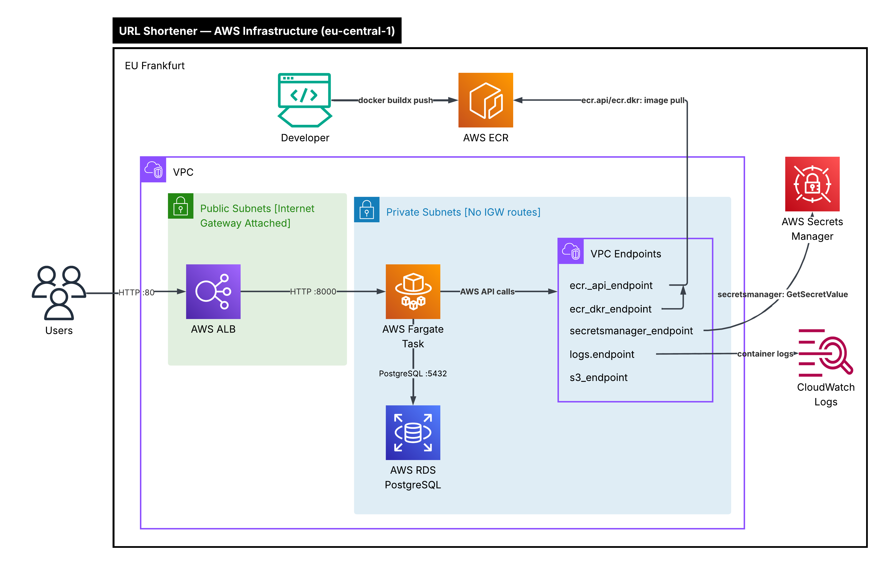

# URL Shortener

A URL shortening REST API built with FastAPI, containerized with Docker, 
deployed on AWS ECS Fargate with RDS PostgreSQL.

## Architecture



- FastAPI (Python) — REST API
- Docker + ECR — containerization
- ECS Fargate — container orchestration
- RDS PostgreSQL — database (private subnet)
- Secrets Manager — credential management
- ALB — load balancing
- Terraform — infrastructure as code
- GitHub Actions — CI/CD pipeline

## Local Development (Sprint 1)

- FastAPI app with two endpoints: POST /shorten and GET /{code}
- Dockerized with multi-stage Dockerfile
- Docker Compose for local development with PostgreSQL
- Data persistence via Docker volumes

### Prerequisites
- Python 3.12+
- Docker Desktop

### Run locally
```bash
python3 -m venv venv
source venv/bin/activate
pip install -r requirements.txt
uvicorn main:app --reload
```

API docs available at http://localhost:8000/docs

## Infrastructure (Sprint 2)

Provisioned via Terraform:
- VPC with public and private subnets across two availability zones
- ECR repository for Docker image storage
- RDS PostgreSQL in private subnets — no public access
- Secrets Manager storing database credentials as JSON
- Security groups for ALB, ECS app, and RDS with least-privilege rules


## Deployment (Sprint 3)

Provisioned via Terraform:
- ECS Fargate cluster and service running the containerized FastAPI app
- ALB with HTTP listener, target group, and health checks
- ECS tasks in private subnets — no public IP assigned
- VPC endpoints for ECR (ecr.api, ecr.dkr), Secrets Manager, and S3 — allows private subnet tasks to reach AWS services without IGW
- IAM task execution role with least-privilege policies for ECR pull and Secrets Manager access
- Security groups using SG references (not CIDR blocks) for ECS-to-RDS and ALB-to-ECS traffic

App is publicly reachable via ALB DNS. RDS remains in private subnet with no public access.

### Test the live API
```bash
# Health check
curl http://<alb-dns>/health

# Shorten a URL
curl -X POST http://<alb-dns>/shorten   -H "Content-Type: application/json"   -d '{"long_url": "https://example.com"}'

# Follow the redirect
curl -L http://<alb-dns>/<short-code>
```

## CI/CD Pipeline (Sprint 4)

GitHub Actions workflow on push to main:
- Builds Docker image for linux/amd64
- Tags image with Git SHA — unique tag per commit, no manual versioning
- Pushes image to ECR
- Downloads current ECS task definition
- Renders new task definition with updated image URI
- Deploys to ECS and waits for service stability

Authentication via OIDC — no static AWS credentials stored in GitHub secrets.

## Project Status
🚧 In progress — Sprint 4 of 6 complete