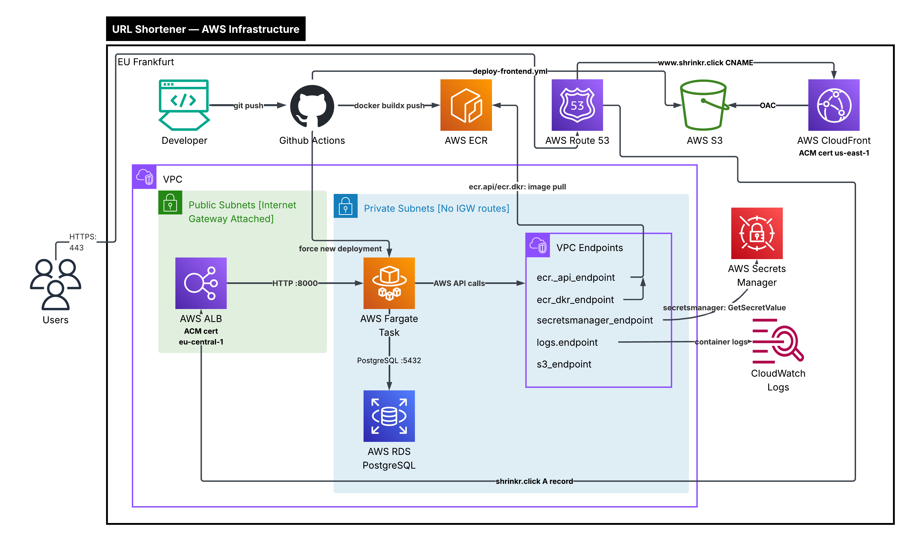

# URL Shortener

A production-grade URL shortening service built with FastAPI, containerized with Docker, deployed on AWS ECS Fargate with RDS PostgreSQL, served over HTTPS via a custom domain.

## Architecture



- FastAPI (Python) — REST API
- Docker + ECR — containerization
- ECS Fargate — container orchestration (private subnets)
- RDS PostgreSQL — database (private subnet)
- Secrets Manager — credential management
- ALB — load balancing with HTTPS termination
- CloudFront + S3 — static frontend with CDN
- Route 53 + ACM — custom domain with TLS certificates
- VPC Endpoints — private AWS service connectivity (no IGW)
- Terraform — infrastructure as code
- GitHub Actions + OIDC — CI/CD pipeline

## Local Development (Sprint 1)

- FastAPI app with two endpoints: POST /shorten and GET /{code}
- Dockerized with multi-stage Dockerfile
- Docker Compose for local development with PostgreSQL
- Data persistence via Docker volumes

### Prerequisites
- Python 3.12+
- Docker Desktop

### Run locally
```bash
python3 -m venv venv
source venv/bin/activate
pip install -r requirements.txt
uvicorn main:app --reload
```

API docs available at http://localhost:8000/docs

## Infrastructure (Sprint 2)

Provisioned via Terraform:
- VPC with public and private subnets across two availability zones
- ECR repository for Docker image storage
- RDS PostgreSQL in private subnets — no public access
- Secrets Manager storing database credentials as JSON
- Security groups for ALB, ECS app, and RDS with least-privilege rules

## Deployment (Sprint 3)

Provisioned via Terraform:
- ECS Fargate cluster and service running the containerized FastAPI app
- ALB with HTTPS listener, target group, and health checks
- ECS tasks in private subnets — no public IP assigned
- VPC endpoints for ECR (ecr.api, ecr.dkr), Secrets Manager, CloudWatch Logs, and S3
- IAM task execution role and task role with least-privilege policies
- Security groups using SG references (not CIDR blocks)

### Test the live API
```bash
# Health check
curl https://shrinkr.click/health

# Shorten a URL
curl -X POST https://shrinkr.click/shorten \
  -H "Content-Type: application/json" \
  -d '{"long_url": "https://example.com"}'

# Follow the redirect
curl -L https://shrinkr.click/<short-code>
```

## CI/CD Pipeline (Sprint 4)

Two GitHub Actions workflows:

**deploy.yml** — triggers on changes to `main.py`, `Dockerfile`, `requirements.txt`:
- Builds Docker image for linux/amd64, tagged with Git SHA
- Pushes to ECR
- Updates ECS task definition and deploys to Fargate
- Waits for service stability before marking green

**deploy-frontend.yml** — triggers on changes to `website/index.html`:
- Uploads to S3
- Invalidates CloudFront cache

Authentication via OIDC — no static AWS credentials stored in GitHub secrets.

## Frontend + Custom Domain (Sprint 5)

- Static HTML frontend served from S3 via CloudFront at `https://www.shrinkr.click`
- Custom domain `shrinkr.click` registered in Route 53
- ACM certificates — eu-central-1 for ALB, us-east-1 for CloudFront (AWS requirement)
- HTTP redirects to HTTPS automatically
- Route 53 DNS split: `shrinkr.click` → ALB, `www.shrinkr.click` → CloudFront
- URL deduplication — same URL always returns the same short code

## Project Status
✅ Complete — Sprint 5 of 5